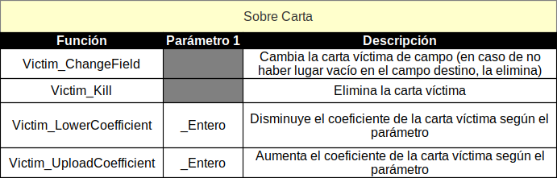

# Ave Cesar

El presente juego de cartas constituye el segundo proyecto de la asignatura de Programación de los autores. A continuación se hará una breve descripción de las reglas del mismo, así como algunas puntualizaciones respecto al soporte. Esperamos que sea de su agrado

## Preste atención!!

Requisitos para jugar
* La resolución de su pantalla debe ser 16:9. Esto es necesario para que no se distorsionen determinados elementos visuales.
* Debe estar trabjando en alguna distribución de Linux.
* Usted debe correr el ejecutable ´Ave Cesar.86_64´ que se encuentra en la carpeta principal

## Sobre la ejecución

Al abrir el archivo nos encontramos con el tradicional menú. Luego de entrar a ´New Game´, podemos seleccionar los partícipes de la batalla de cartas.
Una vez en el juego nos encontramos con varias áreas.

### La mano

El panel inferior constituye las cartas que tiene el jugador. Como máximo este puede tener 5 cartas a la vez en la mano. De tener menos puede robar cartas pinchando en el mazo(señalado en rojo en la imagen). Solo podrá robar una vez por turno.

### Las cartas

Nuestro juego cuenta con tres tipos de cartas: Hackers, Algoritmos y cartas de efecto especial. Las primeras son las encargadas directas de disminuir la cantidad de información encriptada del adversario mediante su propiedad capacidad. Este tipo de cartas permanece en el campo por tres turnos. Al pasar el cursor por encima de una carta se muestra una ampliación de la misma en el lado izquierdo del campo y un panel con una descripción para esta en el lado derecho, en la primera línea de la información estará reflejada la capacidad. Los Algoritmos funcionarán como la antítesis de los Hackers, siendo, la defensa de tu información, su misión principal; estos cuentan con una resistencia, la cual será el valor que afectarán los hackers al no poder afectar tu información.

Las cartas Efecto se subdividen en dos conjuntos: cartas de efecto sobre un campo o aspecto general de la partida, y cartas de efecto sobre otra carta específica. En el panel de la derecha debe existir una descrpción de esta carta(esperemos que quien la cree no sea demasiado peresozo).

### El campo

 El campo de batalla juega, sin duda, un lugar muy importante de la trama de nuestro juego, pues además de ser el espacio en donde se colocan las cartas, la disposición de este también influirá en el curso de la partida.
 En el campo se disponen paneles con cuadrados de diferentes colores, para colocar diferentes cartas: rojo para hackers, azul para algoritmos y verde para cartas efecto.
 Un jugador solo podrá jugar cartas Algoritmo en los recuadros azules más cercanos a su mano, esta constituirá su línea de defensa. Si una posición de estas está vacía, el contrario podrá afectar su información directamente colocando un hacker en la casilla roja que está inmediatamente al frente de la azul vacía.
 Usted podrá jugar cartas de tipo Hacker en las casillas rojas más alejadas de su mano, esta será su línea de ataque. Desde aquí sus hackers podrán desencriptar a los algoritmos que les hagan frente y en el mejor caso, si no hubieran algortimos defendiendo, directamente a la información del contrario.
 
 Las cartas efecto que afectan un aspecto general del juego se colocan en las casillas verdes, mientras que las que afectan a otra carta en específico se dejarán caer sobre la carta víctima. Si la condición para aplicar el efecto no es verdadera esta carta será descartada en el siguiente turno.

 Un jugador solo podrá jugar dos cartas por turno. Pierde aquel que primero se quede sin información encriptada.

## Instrucciones para el uso del compilador:

Este compilador por su disposición busca ser lo mas amigable posible con el usuario. Cuenta con un desplegable en el cual se puede seleccionar el tipo de carta a crear (Hacker, Algorithm o Effect)

### El tipo Hacker:
Cuenta con tres campos a llenar
* Name: recibe una cadena de texto preferiblemente breve con la que se identificara la carta
* Description: recibe una cadena de texto regularmente más larga en la cual se describe la carta
* Capacity: recibe un valor numérico. De lo contrario esta carta no podrá ser creada

### El tipo Algorithm:
Es muy similar a Hacker solo que en lugar del campo Capacity cuneta con el campo Resistance que también recibe un valor numérico

### El tipo Effect:
Cuenta con cuatro campos a llenar:
* Name y Description que, al igual que en los casos anteriores reciben una cadena de texto
* Condition: recibe una instruccion que pueda ser leída como una condición
* Effect: este tipo de carta se divide en dos grandes grupos
  * EffectOverCard: este efecto se aplicará sobre una carta víctima que será escogida en tiempo de juego
  * EffectOverField: este efecto afecta al estado del juego en general

Estos efectos son elaborados a partir de funciones que el compilador es capaz de leer,
las funciones a utilizar en cada caso son las siguientes:
        
  

Una carta puede realizar no solo una acción para esto se concatenan mediante el caracter ; las acciones a ejecutar por la carta.

IMPORTANTE: una carta de tipo EffectOverCard solo puede ejecutar las funciones que aparecen en la tabla correspondiente, lo mismo para las cartas de tipo EffectOverField. ESTAS FUNCIONES NO SE PUEDEN MEZCLAR.

Ejemplos
 * (EffectOverCard) Victim_ChangeField;Victim_UploadCoefficient_2  //este efecto cambia la carta víctima de campo y aumenta su coeficiente en 2
 * (EffectOverField) Sweep_Adversary_Algorithms;LowerLife_Adversary_10  //este efecto elimina todas las cartas del campo de Algorithms del contrario y le baja 10 de vida

Qué puede leerse como una condición?
* Literales: true, false 
* Comparaciones: se entiende como la relación de dos enteros por un operador (<, >, =) y la sintaxis apropiada para eso es entero1 (espacio) operador (espacio) entero2
* Predicados: Para Todo y Existe (como en lógica). La sintaxis de los mismos se explica mejor en la siguiente tabla

    

Un predicado encabezado con un ForAll (Para Todo) es verdadero si la condición expuesta se cumple para todos los elementos del campo en cuestión.

Un predicado encabezado por un Exist (Existe) es verdadero si la condición es verdadera para al menos un elemento del campo en cuestión.

Estas operaciones pueden combinarse con los operadores and y or y ser agrupadas por parentesis (siempre dejando espacios)

Ejemplo:
5 > 4 and ( true or ForAll_Own_AlgorithmField_Card.Resistance > 6 )

Qué puede leerse como un entero?
El compilador es capaz de leer valores numericos y cadenas de texto que representan la vida de los jugadores
* Own.Life representa la vida del jugador que esta en turno en el momento
* Adversary.Life representa la vida del jugador que no esta en turno en el momento
