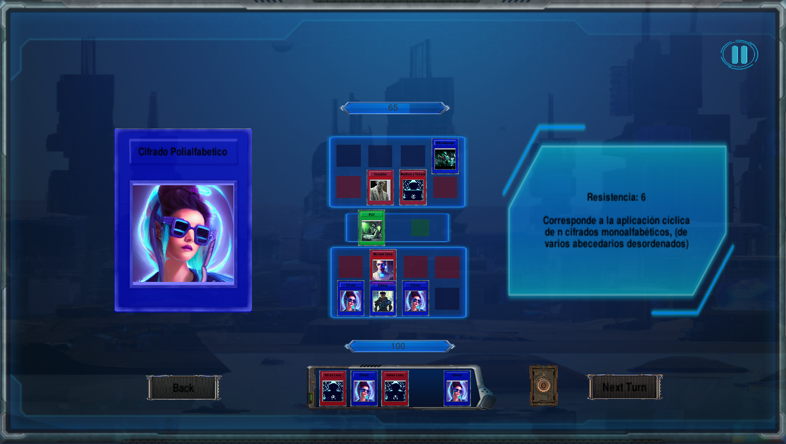
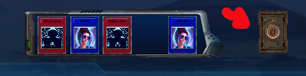
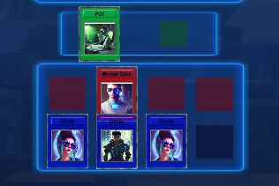

# Ave Cesar

El presente juego de cartas constituye el segundo proyecto de la asignatura de Programación de los autores. A continuación se hará una breve descripción de las reglas del mismo, así como algunas puntualizaciones respecto al soporte. Esperamos que sea de su agrado

## Preste atención!!

Requisitos para jugar
* La resolución de su pantalla debe ser 16:9. Esto es necesario para que no se distorsionen determinados elementos visuales.
* Debe estar trabjando en alguna distribuvión de Linux.
* Usted debe correr el ejecutable ´Ave Cesar.86_64´ que se encuentra en la carpeta principal

## Sobre la ejecución

Al abrir el archivo nos encontramos con el tradicional menú. Luego de entrar a ´New Game´, podemos seleccionar los partícipes de la batalla de cartas.
Una vez en el juego nos encontramos con varias áreas.

### La mano

El panel inferior constituye las cartas que tiene el jugador. Como máximo este puede tener 5 cartas a la vez en la mano. De tener menos puede robar cartas pinchando en el mazo(señalado en rojo en la imagen). Solo podrá robar una vez por turno.

### Las cartas

Nuestro juego cuenta con tres tipos de cartas: Hackers, Algoritmos y cartas de efecto especial. Las primeras son las encargadas directas de debilitar los puntos de vida del adversario mediante su propiedad capacidad. Al pasar el cursos por encima de una carta se muestra una ampliación de la misma en el lado izquierdo del campo y un panel con una descripción para esta en el lado derecho, en la primera línea de la información estará reflejada la capacidad. Los Algoritmos funcionarán como la antítesis de los Hackers, siendo la defensa de tus puntos de vida su misión principal; estos cuentan con una resistencia, la cual será el valor que afectarán los hackers al no poder afectar tus puntos de vida.

Las cartas Efecto se subdividen en dos conjuntos: cartas de efecto sobre un campo o aspecto general de la partida y cartas de efecto sobre otra carta específica. En el panel de la derecha debe existir una descrpción de esta carta(esperemos que quien la cree no sea demasiado peresozo)

### El campo

 El campo de batalla juega, sin duda, un lugar muy importante de la trama de nuestro juego, pues además de ser el espacio en donde se colocan las cartas, la disposición de este también influirá en el curso de la partida.
 En el campo se disponen paneles con cuadrados de diferentes colores, para colocar diferentes cartas: rojo para hackers, azul para algoritmos y verde para cartas efecto.
 Un jugador solo podrá jugar cartas Algoritmo en los recuadros azules más cercanos a su mano, esta constituirá su línea de defensa. Si una posición de estas está vacía, el contrario podrá afectar su vida directamente colocando un hacker en la casilla roja que está inmediatamente al frente de la azul vacía.
 Usted podrá jugar cartas de tipo Hacker en las casillas rojas más alejadas de su mano, esta será su línea de ataque. Desde aquí sus hackers podrán afectar a los algoritmos que les hagan frente y en el mejor caso, si no hubieran algortimos defendiendo, directamente a los puntos de vida del contrario.
 
 Las cartas efecto que afectan un aspecto general del juego se colocan en las casillas verdes, mientras que las que afectan a otra carta en específico se dejarán caer sobre la carta víctima.

 Un jugador solo podrá jugar dos cartas por turno. Pierde aquel que primero se quede sin puntos de vida.

## Instrucciones para el uso del compilador:

Este compilado por su disposición busca ser lo más amigable posible con el usuario. Cuenta con un desplegable en el cual se puede seleccionar el tipo de carta a crear( hacker, algoritmo o efecto)

En el caso de las cartas de tipo hacker o algoritmo cuentan con tres campos a llenar (Name, Capacity o Resistance y Description)
Name y Description reciben cadenas de texto mientras que el 2do campo (Capacity o Resistance) recibe un valor que debe poder ser interpretado como un entero de lo contrario la carta no será creada y será mostrado un mensaje de sintaxis incorrecta.

El caso de las cartas efecto es más complejo por eso ha de analizarse aparte

Cuentan con 4 campos a llenar (name, condición,Effect y description)
Name y description como en los casos anteriores son cadenas de texto 
El campo condición recibe información que ha de poder ser interpretada como una proposición o expresión con un valor de verdad. Para esto el usuario cuenta con un conjunto de elementos e instrucciones que el compilador es capaz de leer.

### Literales (true, false)

Comparaciones entre enteros o expresiones que hagan referencia a un entero (la vida de los jugadores se entiende como Own o Adversary (que hacen referencia a el jugador que invoca la carta o su contrario) seguido de .Life para hacer referencia a la vida del jugador en cuestion)

Predicados Existe y Para Todo representados por las palabras reservadas Exist y ForAll. A continuación el separador _ y la palabra reservada que hace alusión al jugador (Own o Adversary) seguido de _ y el conjunto sobre el que se desea aplicar el predicado que debe ser el campo de hackers (HackerField) o algoritmos (AlgorithmField) del jugador señalado anteriormente y para finalizar _ una instrucción que se pueda interpretar como una condición o proposición que deben cumplir los elementos del conjunto. Este compilador es capaz de interpretar las condiciones siguientes:
Espacio vacío: Carta = EmptySpace
Espacio ocupado: Carta != EmptySpace
Y trabajar con el coeficiente de la carta mediante el texto Carta. Resistance (o Carta.Capacity) = (o < o >) y del otro lado una expresión que pueda ser interpretada como un entero (como se había expuesto anteriormente) 

Estos elementos se pueden combinar utilizando los operadores or y and, también pueden ser agrupados por paréntesis (todo separado por espacios), dando así la posibilidad al usuario de generar una cantidad considerable de condiciones.

Los efectos se subdividen en dos grupos
Efecto sobre campo
Efecto sobre carta
Las acciones sobre campo al ejecutarse afectan el estado del juego en general.
El usuario tiene acceso a 6 palabras reservadas para indicar funciones y mediante _ separar sus correspondientes parámetros si los tienen
LowerLife_: 
Baja la vida de 
Own_ o Adversary_ para hacer referencia a el jugador afectado 
Un entero o una expresión que haga referencia a él que representa el valor en el cual la vida se verá afectada
De manera similar existen las funciones
UploadLife : subir vida
Capacity: afecta segun el valor la capacidad de los hackers del jugador en cuestión
Resistance: afecta segun el valor la resistencia de los algoritmos del jugador en cuestión
Change_: intercambia los campos indicados 
HackersField para indicar el campo de hackers 
AlgorithmField para indicar el campo de algoritmos
Sweep_: barre, limpia o elimina todas las cartas de un campo indicado de un jugador 
Hackers_, Algorithms_ o All_ para indicar el campo 
Own o Adversary para indicar el jugador al cual afectará la acción 

Los efectos sobre carta al ejecutarse afectan las propiedades de una carta en específico 
Para esto el usuario dispone de cuatro funciones que deben estar encabezadas por Victim_
ChangeField cambia la carta de campo si el campo del otro jugador tiene un espacio vacío, de lo contrario elimina la carta

Kill elimina la carta
LowerCoefficient_ disminuye el coeficiente (resistencia o capacidad) de la carta en cuestión en un valor entero o una expresión que se pueda entender como entero
UploadCoefficient_ funciona similar al anterior pero aumenta el coeficiente 
Estos efectos pueden componerse mediante ; de forma que una misma carta pueda ejecutar varias de estas acciones